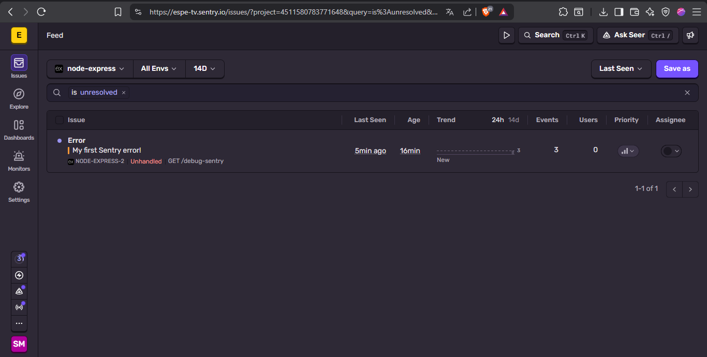
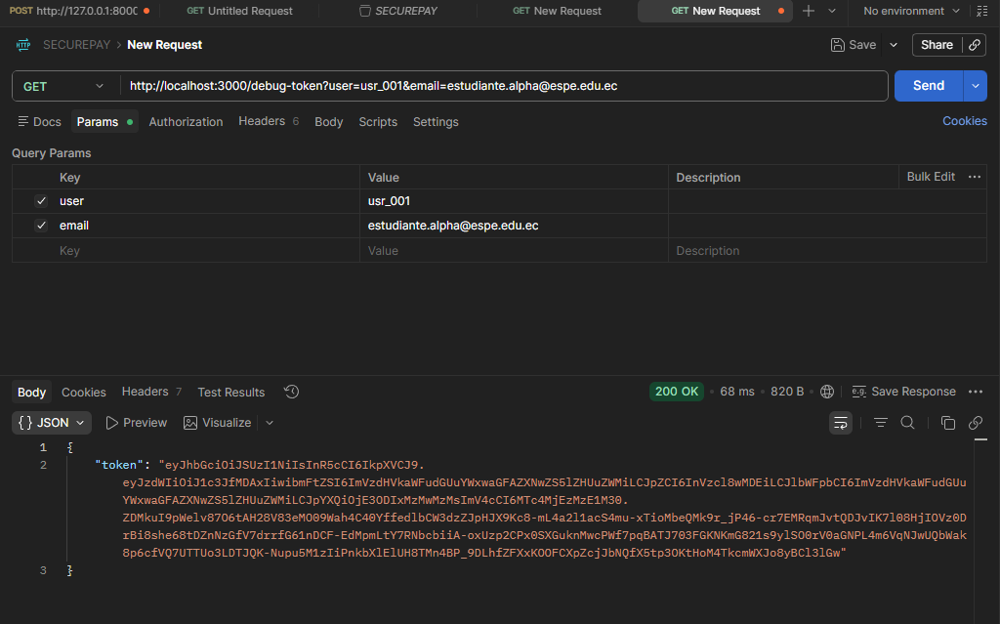
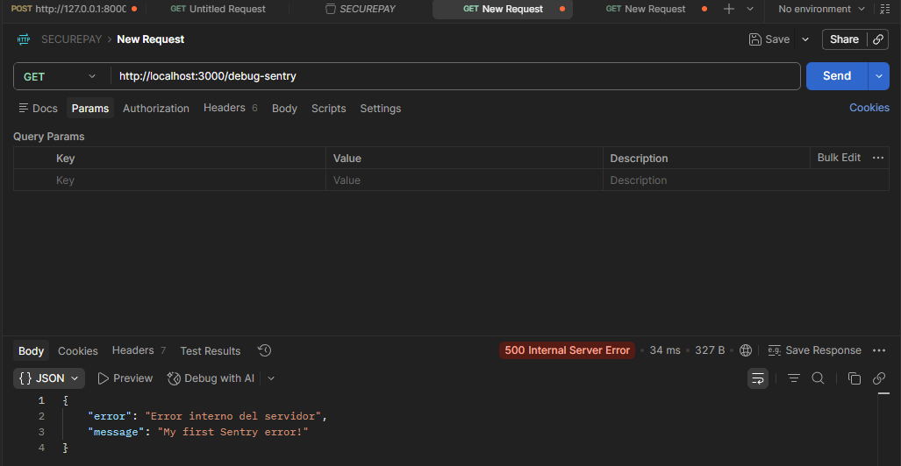
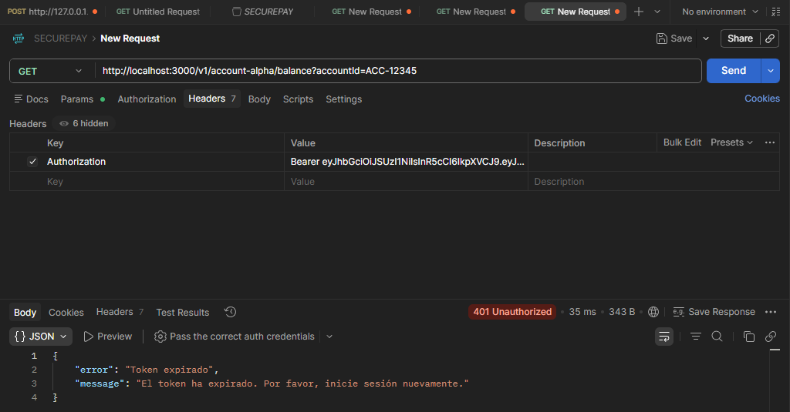
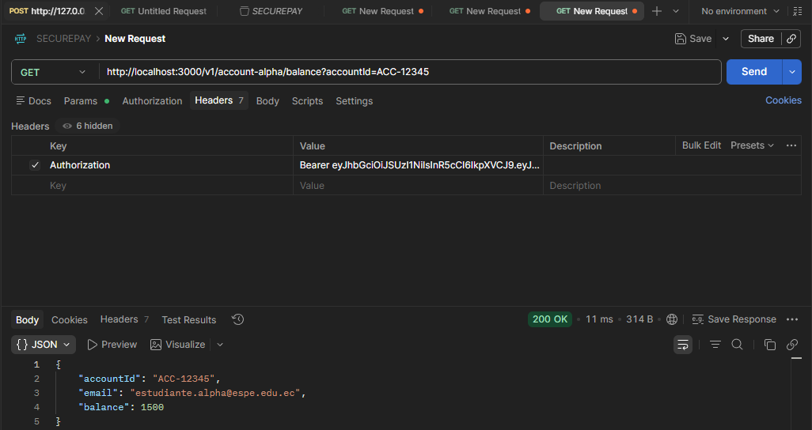
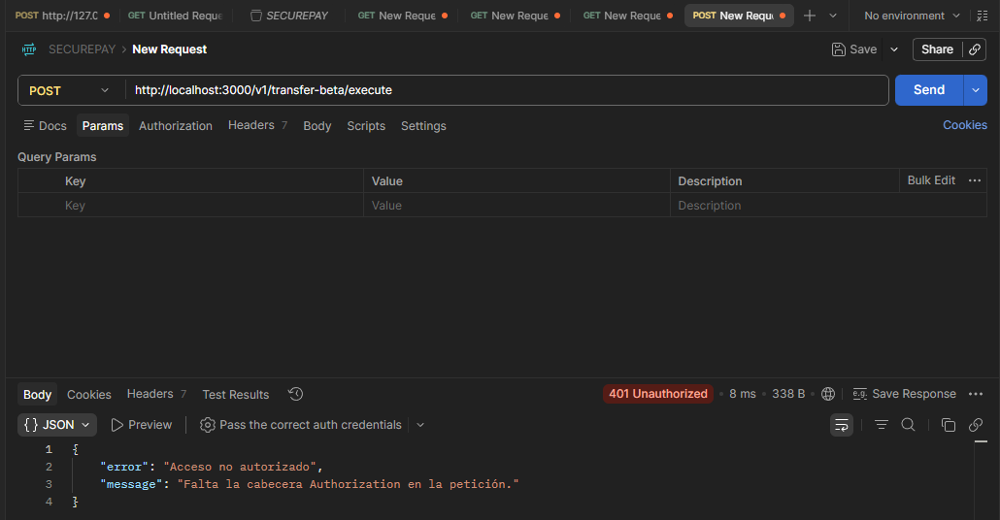
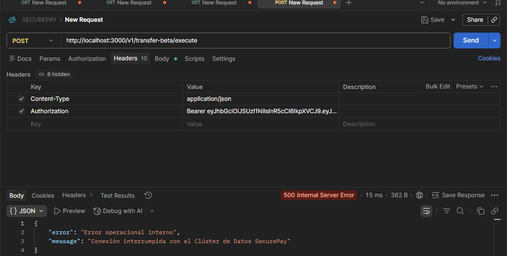
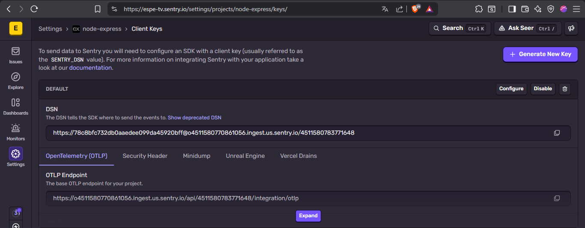
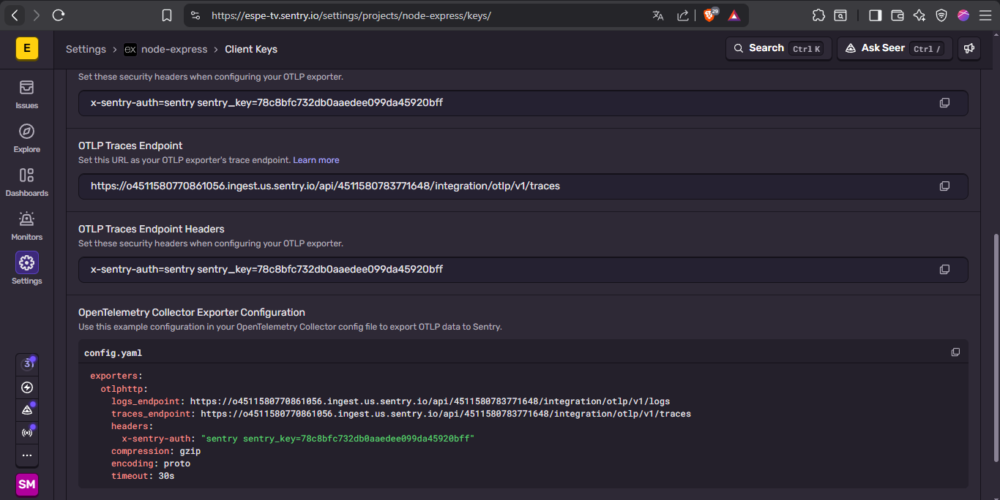

# Fintech SecurePay - Refactorización, Seguridad y Observabilidad

### 1. Refactorización SOLID
- Descompuesto `src/services/transaction.monolith.service.js` en servicios de responsabilidad única:
  - `src/services/transaction.validation.service.js`
  - `src/services/transaction.storage.service.js`
  - `src/services/transaction.notification.service.js`
- El controlador principal ahora inyecta dependencias por constructor en lugar de usar un monolito global.

### 2. Seguridad JWT RS256
- Completado `src/services/jwt.service.js` con:
  - `signToken(user)` usando `private.pem` y `RS256`
  - `verifyToken(token)` usando `public.pem` y forzando `algorithms: ['RS256']`
- Actualizado `src/middlewares/auth.middleware.js` para extraer el Bearer Token y validar el JWT asimétrico de manera autónoma.
- Implementado manejo de errores controlado:
  - `401` para tokens expirados
  - `403` para tokens inválidos

### 3. Observabilidad y Sentry
- Creado `src/instrument.js` y configurado como primera importación en `index.js`.
- Integrado `@sentry/node` con `requestHandler` y `errorHandler`.
- En `POST /v1/transfer-beta/execute`, se simula un error operacional con el payload `forceDatabaseFailure: true`, capturando el fallo en Sentry y etiquetando con `user.id` extraído del JWT.

## Archivos importantes
- `index.js`
- `src/instrument.js`
- `src/services/jwt.service.js`
- `src/middlewares/auth.middleware.js`
- `src/services/transaction.monolith.service.js`
- `src/controllers/transfer.controller.js`

## Consideraciones de seguridad
- `.gitignore` excluye `node_modules/`, `*.pem`, `.env` y `.DS_Store`.
- No se deben subir las llaves privadas ni variables de entorno locales al repositorio.

## Uso de prueba
1. Generar llaves con `./keypair.sh` si aún no existen.
2. Configurar `.env` con `SENTRY_DSN` y `PORT`.
3. Ejecutar la API con `npm start`.

### Ejemplo de payload para error Sentry
```json
{
  "fromAccountId": "ACC-12345",
  "toAccountId": "ACC-67890",
  "amount": 100,
  "forceDatabaseFailure": true
}
```

## Capturas
- Token JWT generado con `RS256` y expiración de 2 minutos.
- Acceso válido a `GET /v1/account-alpha/balance` con cabecera `Authorization: Bearer <token>`.
- Respuesta controlada `401`/`403` para tokens expirados o malformados.
- Evento `500` en Sentry con tag `user.id` al provocar el fallo operacional.

### Capturas de Postman y Sentry

#### 1. Token generado en `/debug-token`


#### 2. Request válida a `GET /v1/account-alpha/balance`


#### 3. Error `401 Token expirado`


#### 4. Request a `/debug-sentry` con error 500


#### 5. Request a `/v1/transfer-beta/execute` con `forceDatabaseFailure`


#### 6. Evento capturado en Sentry


#### 7. Detalle y tags del evento Sentry


#### 8. Captura del panel de Sentry con el DSN activo


#### 9. Evidencia de no envío en errores lógicos 401/403

